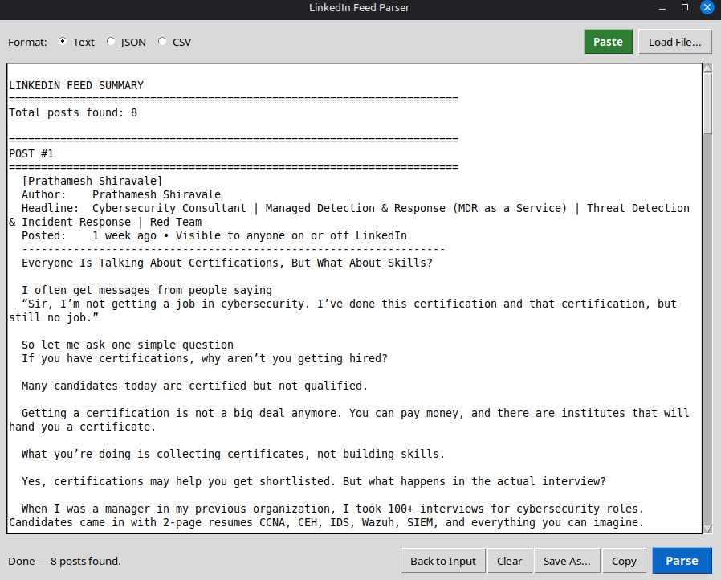

# LinkedIn Feed Parser

A desktop GUI tool that parses raw LinkedIn feed HTML into clean, readable post summaries. Quickly scan your entire feed without clicking "Read more" on every single post.



## Why?

LinkedIn's feed buries content behind "Read more" buttons, ads, and endless scrolling. This tool lets you:

- **See full post content** at a glance — no clicking "Read more" on every post
- **Scan your feed quickly** to decide which posts are worth engaging with
- **Extract comments** that are visible in the feed
- **Export to Text, JSON, or CSV** for further use

## How to Get the HTML

1. Open your LinkedIn feed in a browser
2. **Scroll down** as far as you want — the more you scroll, the more posts get loaded into the page
3. Right-click anywhere on the page and select **Inspect** (or press F12)
4. In the Elements tab, find the opening `<html>` tag — it starts with:
   ```
   <html lang="en" class="theme theme--mercado app-loader--default artdeco">
   ```
5. Right-click that `<html>` tag and select **Edit as HTML** (or **Copy > Copy outerHTML**)
6. Select all (`Ctrl+A`) and copy (`Ctrl+C`)

That's the HTML you paste into the parser.

> **Tip:** The more you scroll on LinkedIn before copying, the more posts will be in the HTML. LinkedIn lazy-loads content as you scroll.

## Usage

### GUI (Double-click)

```bash
python3 parse_linkedin_feed.py
```

1. Click **Paste** (green button) to paste your copied HTML
2. Choose format: **Text**, **JSON**, or **CSV**
3. Click **Parse** (blue button)
4. Click **Copy** to copy results to clipboard, or **Save As** to export

### CLI

```bash
# Text output to terminal
python3 parse_linkedin_feed.py feed.html

# JSON output
python3 parse_linkedin_feed.py feed.html --json

# CSV output saved to file
python3 parse_linkedin_feed.py feed.html --csv -o posts.csv
```

## What It Extracts

For each post:

| Field | Description |
|-------|-------------|
| **Author** | Name and headline/title |
| **Timestamp** | Relative time (e.g., "5 days ago") |
| **Content** | Full post text, cleaned of HTML |
| **Reactions** | Count and types (like, celebrate, love, etc.) |
| **Comments** | Count + visible comment text with authors |
| **Reposts** | Count |
| **Hashtags** | All hashtags from the post |
| **Shared articles** | Linked article titles |

## Example Output

```
======================================================================
POST #1
======================================================================
  Author:    Prathamesh Shiravale
  Headline:  Cybersecurity Consultant | MDR as a Service | Threat Detection & Incident Response | Red Team
  Posted:    1 week ago • Visible to anyone on or off LinkedIn
  ------------------------------------------------------------------
  Everyone Is Talking About Certifications, But What About Skills?

  I often get messages from people saying
  "Sir, I'm not getting a job in cybersecurity. I've done this
  certification and that certification, but still no job."

  So let me ask one simple question
  If you have certifications, why aren't you getting hired?
  ------------------------------------------------------------------
  Reactions: 118 (like, insightful, love) | Comments: 12 | Reposts: 5
  Tags: #Cybersecurity #InfoSec #SOCAnalyst

  Comments:
    > Tyler Reynolds (5d): Great breakdown, this is spot on.
```

## Requirements

- Python 3.6+
- `python3-tk` (for GUI mode)
- `xclip` (optional, improves paste reliability on Linux)

```bash
# Ubuntu / Linux Mint
sudo apt install python3-tk xclip
```

No other dependencies — uses only the Python standard library.

## Note on Comments

The parser extracts comments that are **already visible** in the HTML. LinkedIn lazy-loads comments behind "Load more" buttons, so to capture more:

- Click **"Load more comments"** on posts before copying the HTML
- Expand reply threads by clicking **"X replies"**

## License

MIT
